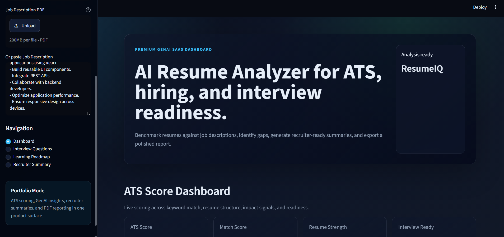
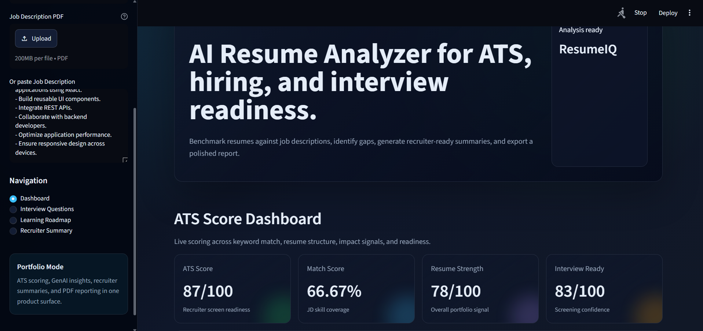
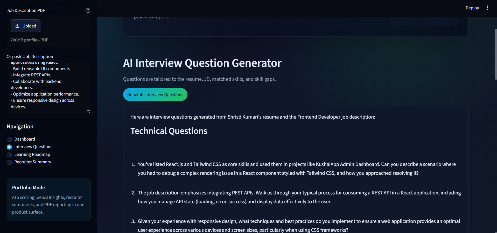
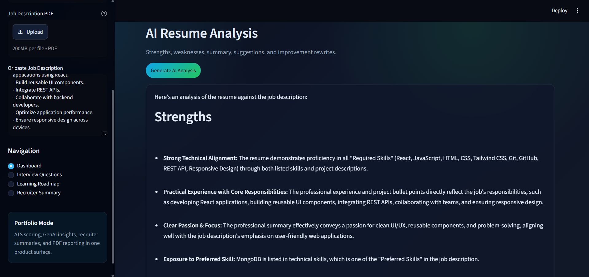
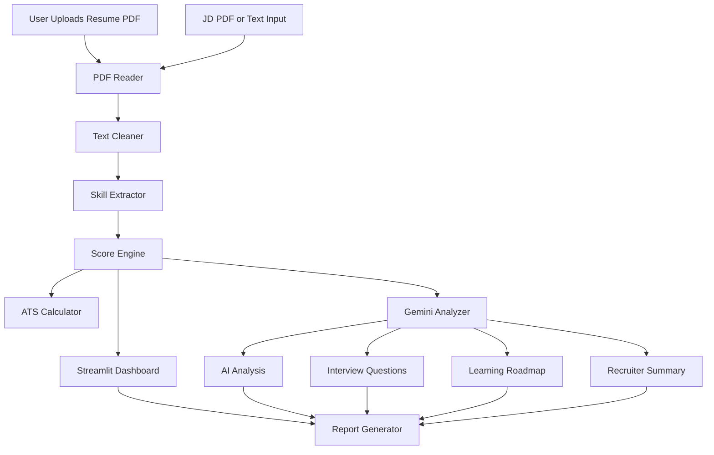

# ResumeIQ - AI Resume Analyzer

ResumeIQ is a production-style GenAI SaaS application that analyzes a resume against a target job description. It combines ATS scoring, skill gap detection, Gemini-powered career insights, interview preparation, learning roadmaps, recruiter summaries, and downloadable reports in a premium Streamlit dashboard.

## Project Overview

This project upgrades a basic resume analyzer into a portfolio-ready AI/ML and GenAI engineering product. It is designed for GitHub portfolios, internship applications, recruiter demos, and resume proof-of-work.

## Features

- Resume PDF upload and text extraction
- Job description PDF upload or pasted JD input
- Resume cleaning and keyword normalization
- ATS score dashboard with breakdown
- Resume match score and strength meter
- Matched, missing, recommended, and emerging skills
- Interactive pie, bar, radar, and skill distribution charts
- Gemini AI resume analysis with graceful offline fallback
- Interview question generator
- Four-week learning roadmap generator
- Recruiter summary generator
- Before/after resume improvement suggestions
- Downloadable professional report
- Dark SaaS UI with glassmorphism cards and responsive layout

## Screenshots

### Dashboard


### ATS Score


### Interview Generator


### AI Analysis


## Architecture Diagram



## Installation

```bash
git clone <your-repo-url>
cd AI-RESUME-ANALYZER
python -m venv venv
venv\Scripts\activate
pip install -r requirements.txt
streamlit run app.py
```

## Environment Setup

Create a `.env` file in the project root:

```env
GEMINI_API_KEY=your_gemini_api_key_here
```

The app still works without a Gemini key by using deterministic fallback analysis, which is useful for demos and offline portfolio reviews.

## Usage Guide

1. Upload a resume PDF from the sidebar.
2. Upload a JD PDF or paste the job description.
3. Review ATS score, match score, skill coverage, and analytics.
4. Generate AI resume analysis.
5. Open the Interview Questions, Learning Roadmap, and Recruiter Summary workspaces.
6. Download the professional report from the dashboard.

## Tech Stack

- Python
- Streamlit
- Pandas
- Plotly
- PyPDF2
- Gemini API
- python-dotenv
- ReportLab

## Folder Structure

```text
project/
├── app.py
├── assets/
│   ├── styles.css
│   └── screenshots/
├── pages/
│   ├── dashboard.py
│   ├── interview_questions.py
│   ├── learning_roadmap.py
│   └── recruiter_summary.py
├── utils/
│   ├── pdf_reader.py
│   ├── text_cleaner.py
│   ├── skill_extractor.py
│   ├── ats_calculator.py
│   ├── score_calculator.py
│   ├── gemini_analyzer.py
│   └── report_generator.py
├── data/
│   └── skills.csv
├── reports/
├── requirements.txt
└── README.md
```

## Future Improvements

- User accounts and saved analysis history
- Resume version comparison
- Role-specific benchmark datasets
- OCR support for scanned PDFs
- Stripe billing for SaaS monetization
- Admin dashboard for recruiter teams
- Multi-model support for Gemini, OpenAI, and local LLMs

## Resume Impact

This project demonstrates:

- Full-stack product thinking with Streamlit
- GenAI prompt orchestration
- PDF parsing and data extraction
- ATS scoring and ranking logic
- Interactive analytics with Plotly
- Modular Python architecture
- SaaS-style UI/UX design
- Production-minded error handling and environment configuration

## LinkedIn Post Template

I built ResumeIQ, a GenAI-powered resume analyzer that compares a resume against a job description and generates ATS scores, skill gaps, AI feedback, interview questions, learning roadmaps, recruiter summaries, and downloadable reports.

Tech stack: Python, Streamlit, Pandas, Plotly, PyPDF2, Gemini API, ReportLab.

This project helped me practice GenAI architecture, resume intelligence, prompt engineering, dashboard design, and production-style Python modularization.

GitHub: <your-link>
Demo: <your-link>

## Portfolio Description

ResumeIQ is a GenAI SaaS-style resume analyzer that helps candidates optimize resumes for ATS systems and recruiters. It parses PDFs, extracts skills, compares them with job descriptions, calculates ATS and match scores, generates AI career insights, prepares interview questions, creates a four-week learning roadmap, and exports a professional report.

## Deployment Guide

### Streamlit Cloud

1. Push the repository to GitHub.
2. Go to Streamlit Community Cloud.
3. Create a new app and select `app.py`.
4. Add `GEMINI_API_KEY` in app secrets.
5. Deploy.

### Render

1. Create a new Web Service.
2. Connect the GitHub repository.
3. Build command: `pip install -r requirements.txt`
4. Start command: `streamlit run app.py --server.port $PORT --server.address 0.0.0.0`
5. Add `GEMINI_API_KEY` as an environment variable.

### Railway

1. Create a new Railway project from GitHub.
2. Add `GEMINI_API_KEY` in Variables.
3. Set start command: `streamlit run app.py --server.port $PORT --server.address 0.0.0.0`
4. Deploy.

## GitHub Optimization

Repository description:

`GenAI-powered ATS resume analyzer with Gemini AI, skill gap detection, interview questions, learning roadmap, recruiter summary, analytics dashboard, and downloadable reports.`

GitHub topics:

`genai`, `resume-analyzer`, `ats-score`, `streamlit`, `gemini-api`, `python`, `plotly`, `machine-learning`, `ai-portfolio`, `job-search`, `career-tech`, `pdf-parser`

SEO keywords:

AI resume analyzer, ATS resume checker, GenAI resume tool, Gemini resume analyzer, Streamlit AI project, machine learning portfolio project, AI internship project, resume match score, skill gap analyzer.

## License

MIT License. You can use, modify, and distribute this project with attribution.

## Author

Built by **Your Name** as a portfolio-ready GenAI engineering project.
